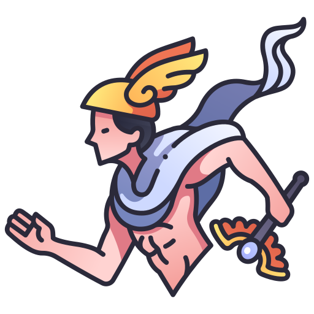

# ☀️ Welcome

First day? Lost?

Lets get started on the right foot!

Welcome to your onboarding chat - ask questions and stop me at any time.

---

<!-- Speaker Notes -->

## What is hermes-crypto?

We are a fun, in browser game with a greek theme that aims to be calming, non competitive and embodies being whimsical. Users simply vote if the price of BTC will go up or down & we add or subtract to their score after 60 seconds; resolving the vote.

- `Goal`: Create a reliable page that is intuitive and fun.
- `Users`: For now? Technical folks.
- `Competitors`: Like us? Not many. All other pages dedicated to this up and running focusses on events and winning coins.

<!-- Give some more insight into the project itself -->

---

### So what are the main features?

The game itself is simple; we want simple user identification & simple vote resolution coupled with clear feedback to users.

- Sign in > create user
- If not & you vote then > create dummy user
- We get the current BTC price in USD at vote
- Wait 60 seconds & check the latest BTC price at USD
- Update user score based on prediction

<!-- Mention here that the mechanism for determining the vote resolution can be improved but we will look at that later. -->

---

### Assumptions

Vote state can be resolved, pending or expired. Expired votes are calculated as soon as the client check for results.

Votes that are a draw, are currently counted towards `+1` point.

<!-- Again, mention that we can alter this, this was just left as a current assumption. -->

---

## 🔍 Tech Stack

We have 2 main `repos` to consider, those being:

1. [`hermes-crypto-core`](https://github.com/svbygoibear/hermes-crypto-core): B/E App in Go
   
2. [`hermes-crypto`](https://github.com/svbygoibear/hermes-crypto): F/E using React & Typescript
   

<!-- Mention for both VSCode has been used as development environments, but for setup on their machines they can use Goland or whichever IDE they feel more comfortable in. -->

---

## 📄 Backend Walkthrough

To cover the basics, we are working with:

- DynamoDB
- Golang
- Gin for routing

Time to look at what ticks under the hood!

You can have a look here: [hermes-crypto-core](https://github.com/svbygoibear/hermes-crypto-core)

<!-- Side-by-side demo of what currently exists in the B/E and its docs. -->

---

## 📄 Frontend Walkthrough

Overall the F/E consists of a page that makes use of:

- React & Vite
- Typescript
- And a few more bits and bobs...

Less talk, more show > let us head off to the code again.

You can have a look here: [hermes-crypto](https://github.com/svbygoibear/hermes-crypto)

<!-- Side-by-side demo of what currently exists in the F/E and its docs. -->

---

## 💣 Live Demo

> Don't tell me the moon is shining; show me the glint of light on broken glass.

What use will it be to just talk about what is going on under the hood and not show what we are actually working with? Time to hop on off to [hermes-crypto.com](https://www.hermes-crypto.com)

<!-- Explain the flow of the page here. -->

---

## Development Cycle

This is the cycle of contribution! We've identified some shortcomings, some enhancements that can be made and now; how do we tackle this as a team?

- Discuss in our morning meeting.
- Create issues; as part of our planning meeting we can discuss who grabs which features/issues.
- Create feature/bug branches.
- Code, commit & PR.

<!-- Explain these are procedures we should develop together and adapt as the need arises. Process should help us, not hinder us. -->

---

## Deployment

As seen on each of the F/E and B/E applications, they are deployed separately. In the next phase of this project, a flow to try out includes:

- Create a staging environment
- Deploy after a successful Pull Request the code into staging & have an internal review phase/enhance testing.
- After bundling a few staging items together, deploy them to production.

<!-- Mention these are future plans. -->

---

## What is coming for the future?

| Feature          | Description                                                                     |
| ---------------- | ------------------------------------------------------------------------------- |
| Vote Review      | Re-look at our current method of calculating votes; async job to be considered. |
| Add Logging      | Investigate and add better logging                                              |
| Improve login    | Add Oauth for better login & logout                                             |
| Create User Dash | Add a user dash with their stats and info                                       |

---

## Now what?

Have more questions? Now is the time!

---

# <!--fit--> END
